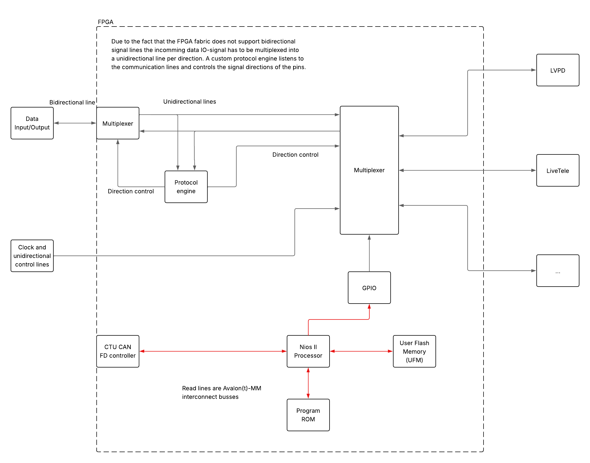

# Kraken
## Description
The Kraken is a project aimed to reduce debugging time. It allows an external J-Link Segger debugger to reprogram/debug the PCBs of the LV stack without needing to open the car. It is a platform build based on a fpga containing custom bidirectional control logic in order to multiplex bidirectional signals, the CTU CAN FD controller, and a nios II softcore microcontroller to manage the control flow. 

 

## Roadmap
### FPGA
- [x] Test nios II softcore microcontroller
- [x] Simulate custom bidirectional controller
- [ ] Build testbench for SWD protocol with custom test/error cases for verification
- [ ] Test bidirectional controller on hardware 
- [ ] Simulate CTU CAN FD controller
- [ ] Test CTU CAN FD controller with custom nios II platform
- [ ] Create final platform with UFM etc.
- [ ] Integrate all the systems and test on hardware

### Nios II firmware
Wait for the fpga to be finished and tested.
- [ ] Create control flow for the CAN controller and implement usage of UFM for persistent values
- [ ] Status leds

### PCB
Wait for fpga and firmware to be finished and tested.
- [ ] Estigmate fpga ressources and choose fpga size
- [ ] Estigmate power usage -> design power supply
- [ ] CAN tranceiver
- [ ] Status leds
- [ ] FTDI chip FT2232H for fpga configuration and uart debug connection
- [ ] Choose connector size and amount for multiplexer
